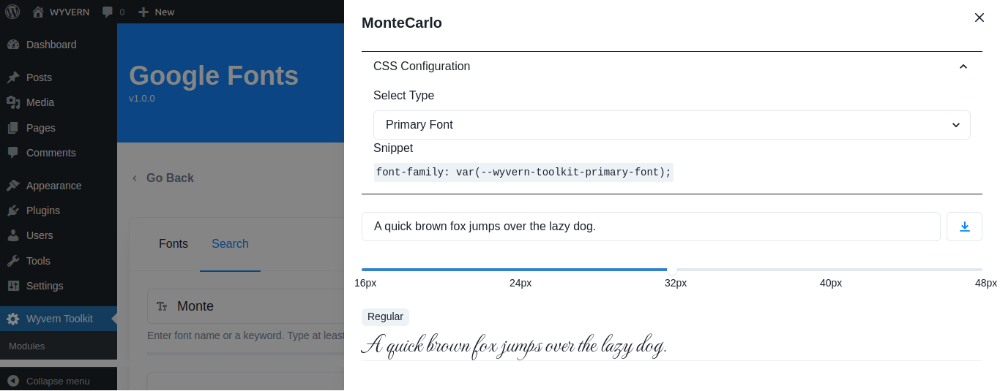

# Wyvern Toolkit

## Description
Wyvern Toolkit Provides you with the necessary tools/modules for your website. It comes with various modules like `Preloader`, `Local Google Fonts`, and `Import Export`. Each module comes with Enable/ Disable option. All modules are disabled by default. You need to enable it to use each module's features.

When you enable the module, You can access customize button of the module. Now you have access to customize the modules as per your need. Here is the list of available modules in the Wyvern Toolkit.

### Preloader
Preloader module helps you to enable Loader on your website while your website is loading data / Images. Here is the steps below to configure Preloader on your website.

- Check the Preloader module to `enable` it.
- Click on the `Customize button`.
- Select Preloader from the available list.
- Select color for the Preloader.
- Click on the `Save` button for Changes.
- Browse the website to see the recently changed Preloader on website load. 

## Screenshots

|  |  |
| ----------- | ----------- |
| Preloader  | Select Preloader  |

### Google Font
Google Font module helps you to enable a local font loading option rather than a CDN URL. Here are the steps below to configure Google Font on your website.

- Check the Google Font module to `enable` it.
- Click on the `Customize button`.
- Search For the font you need to use in your theme/page.
- Click on the `download font` button.

## Screenshots

|  |  |
| ----------- | ----------- |
| Empty Fonts  | Search Fonts  |
| Download Font  | Uses  |

### Import Export
Import Export module helps you to import/export your `customizer`, `widgets`, and `content` of your website. Before Importing You need to export Your data first. Here are the steps below to configure the Import / Export option on your website.

- Check the Import Export module to `enable` it.
- Click on the `Customize button`.
- Click on the `Export` tab.
- Select the available options. There are three options, they are: 
    - `Export Customizer`
    - `Export Widgets`
    - `Export Contents`
- After Selecting the option. You can `export` and `download` the data.
- If you have a wyvern toolkit exported zip file then simply go to the import tab to import the downloaded data.

## Screenshots

|  |  |
| ----------- | ----------- |
| Import  | Export  |